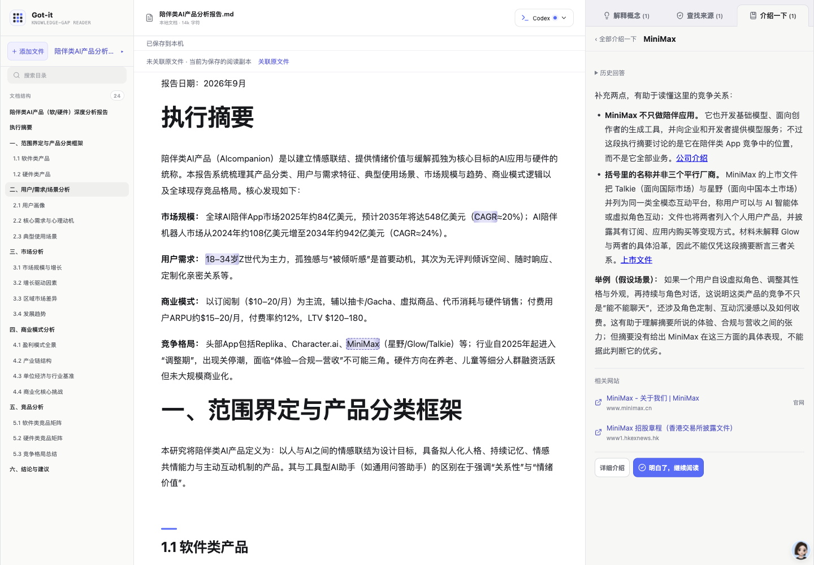

# Got-it

**简体中文** · [English](README.en.md)

**读到不懂的地方，就在原文旁弄明白。**

Got-it 是本地优先的 Markdown / PDF 阅读器。阅读行业报告、产品分析或技术材料时，不必反复复制段落、切到聊天窗口，再回来寻找上下文：选中文字，就能在原文旁解释概念或产品、查找来源，也可提出具体问题。阅读成果随文章保存在本机。

> **v0.1.0 · 早期试用版。** 适合已有 Codex 使用经验的读者。当前已验证 macOS；Windows/Linux 尚未实机验收。没有账号、云同步或多人协作。

## 看看它能做什么

下面使用一份「陪伴类 AI 产品分析报告」展示真实界面与真实模型回答。截图中的市场预测和用户比例是**待核查的报告原文**，不是 Got-it 认可的研究结论；AI 回答也可能出错。历史展示截图仅作为当时界面证据；当前行为与验证范围见[最新更新](docs/updates/2026-10-09.md)。

### 1. 留在文章里阅读

左侧目录帮助定位长报告，正文保留表格与层级，右侧集中回看知识贴。导入自己的 `.md` 或 `.pdf` 文件即可开始，原文件不会被改写。左侧导航可收起以扩大正文；鼠标移到左缘临时展开，也可固定。

发现两份不同且尚未处理的阅读记录时，弹窗用自然语言说明差异，由用户选择当前或之前记录。内容相同、只有一份或已经选择过时，不弹版本选择。点击窗口外或按 Escape 可暂时关闭，本次不重复弹，下次打开文章再提醒未处理差异。旧快照后台保留，不常驻展示相同内容、全量对照或历史入口；只有需要核对的不同回答或原文可按需展开。文件路径及复制按钮始终保留在右侧（窄屏按行排列）。


### 2. 遇到 CAGR，直接解释

选中术语并点击「解释一下」，补充说明就在旁边。首次解释和「再解释下」按需查阅资料：原文足够时直接回答，缺少必要背景或当前信息时在同轮搜索，最多展示两条来源及实际核对状态。再次解释保留旧回答。模型调用本身仍需联网。所有功能默认使用 GPT-6.1 SOL / medium；本机目录暂不支持时保留设置并提示，不自动替换型号。阅读后可直接继续看原文，或返回分类列表；无需确认理解。详情顶部摘录可定位原文，返回列表会恢复之前的位置，历史回答折叠放在当前回答之后。列表的「已有解释／已有回答／已有结果」仅表示回答进展，不代表用户已理解或事实已证实。

请求采用整轮时间预算，超时或停止后保留已收到内容并允许重试；联网补充重试保持联网模式。默认解释/介绍 120 秒、查证 240 秒，可沿用现有环境配置。休眠期间无法更新界面，恢复运行后检查已过期请求。[本次验收与限制](docs/updates/2026-09-30.md)。


### 3. 看到年龄比例，回到来源确认

选中报告里的主张，点击「查找来源」。查看来源页面、引用和限制，再决定怎么使用这段信息；找到链接不等于原文已被证实。


### 4. 不认识产品，先了解背景

选中产品或公司，同样点击「解释一下」。原来的介绍记录归入解释分类，内容和历史保留。选区另有「查找来源」和按需展开的「自己提问…」入口；具体问题单独保存，可继续追问。

同一处原文的解释、来源、具体问题可在右侧切换，一次只展开一个结果。首次点击原文优先解释，之后恢复该处上次查看的结果；从列表指定条目时直接打开所选结果，不触发模型。

[三种结果的真实走查与当前截图](docs/updates/2026-10-09.md)。下面产品介绍截图为合并前的历史界面。



分类标题右侧的垃圾桶可开启删除模式。点击某条右侧垃圾桶变为确认图标，再次点击删除该知识贴及全部回答；按 Esc 或再次点击标题垃圾桶退出。删除不改写原文，同一选区的其他知识贴保留。

### 5. 直接阅读 PDF 图文

PDF 保留原始页面，不需要另找图片文件。有文字层时直接光标选字；正文不可选、图片或版面复杂时，使用「框选内容」，立即选择「解释一下 / 查找来源」，或展开「自己提问…」并提交问题。点击功能后才进行本机识别，将原图和辅助文字交给模型。

框选时把标题、图例及必要说明一起框入。取消、Esc 或点击空白处清除选区。详情顶部摘录或「第 N 页 · 所选区域」可定位原页；窄屏定位成功后收起回答面板。详情不再提供独立预览和 OCR 纠正入口，原图、识别文字和已有修正记录仍保留，重试沿用原有上下文。保存后重开可点击标记查看已有回答。侧栏悬停展开会让阅读区同步缩小，单个图钉切换固定状态。页码、框选、操作说明和保存状态合并在一条 36px 吸顶工具栏中，页码随滚动更新，不在每页重复占行。


[本轮交付与验收范围](docs/updates/2026-09-30.md)。上述 Markdown 画面仍展示之前版本；这张 PDF 画面使用安全合成材料。

## 运行环境

| 项目 | 首版支持基线 |
| --- | --- |
| Node.js | **24.14.1，Node 24 系列**（见 `.nvmrc`） |
| npm | **11.x**，本次实测 11.12.1 |
| 系统 | macOS Apple Silicon 已实测；Windows/Linux 实验性 |
| 浏览器 | 本次使用 Chromium 系浏览器；其他浏览器未专项验收 |
| AI | 本机可用且已登录的 Codex；模型列表由本机 Codex 返回 |
| 网络 | 安装依赖、AI 回答和来源查找需要联网；已保存文章可本地阅读 |

macOS 优先使用系统或用户 Applications 中的 Codex.app / ChatGPT.app 运行程序（兼容新版 codex-cli/bin 目录）；没有时使用 PATH 中的 `codex`。也可用 `CODEX_CLI_PATH` 显式指定。CLI 协议可能随版本变化，本次版本与范围见[验收结果](docs/release-results.md)。

## 快速开始

克隆或下载代码，进入项目目录。若使用 nvm，可先运行 `nvm install` 和 `nvm use`。

```bash
npm ci
npm run build
npm start
```

默认浏览器会打开 <http://127.0.0.1:8787/>。保持终端运行，按 Ctrl+C 停止；之后只需 `npm start`，更新代码后重新执行安装和构建。

`npm ci` 按锁文件安装，需包含开发依赖：当前启动器 `tsx` 也用于本机运行，不要使用 `--omit=dev`。

1. 打开顶部 **AI 设置**，检查 Codex 连接；未登录时可点击「登录 Codex」到官方页面完成授权，也可使用终端 `codex login`。
2. 添加 Markdown / PDF，或先用内置示例体验。
3. Markdown 在同一段落/单元格中选字；PDF 可选字或框选图片，选择一种功能。
4. 等待「已保存到本机」，下次启动可继续阅读。

本轮已完成干净 Codex 配置下的首次登录、模型加载及登录后真实回答验收，详见验收结果。Got-it 不读取、复制或保存 Codex token。首次安装无需向项目作者提供 API Key 或登录凭据。登录方式见 [Codex 官方说明](https://learn.chatgpt.com/docs/auth)。

开发：

```bash
npm run dev
```

前端为 `127.0.0.1:5173`，API 为 `127.0.0.1:8787`。禁止自动开页可设置 `BROWSER=none`；PowerShell 使用 `$env:BROWSER="none"`。环境变量需由启动终端传入，`.env.example` 是配置说明，应用不会自动读取 `.env`。

## 保存与隐私

- Markdown 快照、PDF 原文件副本、识别资源、裁图、知识贴、回答和学习状态保存在本机磁盘，不改写原文件。浏览器仅保存偏好和必要的应急缓存。
- 默认数据目录：macOS `~/Library/Application Support/Got-it`；Windows `%LOCALAPPDATA%/Got-it`；Linux `$XDG_DATA_HOME/got-it` 或 `~/.local/share/got-it`。可通过 `GOT_IT_DATA_DIR` 指定；同一数据目录只运行一个服务。
- PDF 导入打开后自动生成原文章节目录：优先读取内置书签，否则在本机提取原文大标题；识别期间可继续阅读，目录显示页码、支持标题搜索及点击跳转。成功后自动保存，重开直接恢复；旧库无目录的 PDF 打开时自动补建。仅识别失败时显示“重新识别”，不提供核对、编辑或手动保存入口。读取/保存失败会明确提示并提供对应重试；保存重试复用已有识别结果。
- PDF 的文字识别在本机进行，安装时准备中文/英文模型和 worker，阅读时不从 CDN 获取。图片解释会将确认的裁图发给模型。
- 每次 AI 请求发送当前选区、有限邻近上下文、标题和当前知识贴必要历史，不默认发送全文。**本地保存不等于模型离线运行。**
- 来源核对只读取有限数量的公共网页，不携带用户网页登录凭据；不是所有来源都能读取或核对。
- 保存失败会保留应急内容并提供重试；冲突时保留双方再核对。不要通过清除浏览器数据解决保存问题。
- 本机保存不等于异地备份。重要成果需另外备份应用数据目录，建议停止服务后备份整个目录。

## 当前限制

- 仅支持 Codex；需要用户自己的可用账号、网络与模型额度。
- 一次展开一份 Markdown 或 PDF；暂不支持 Word、原文编辑、云同步。
- PDF 限 50 MiB、200 页且不能加密；保持固定版面，不能像 Markdown 一样随宽度重排。各页上下连续排列，自动适合阅读区宽度，随窗口和侧栏变化调整。
- 本机 OCR 首轮覆盖简体中文和英文，复杂页面须先框同一栏；数字、符号及小字可能识别错误，可通过顶部摘录返回原页核对；当前详情不提供识别文字编辑入口。识别不等于核实。单次识别限 60 秒，可取消/重试。
- 无书签 PDF 的目录属于版面识别候选：每页优先提取一个主要标题，分篇封面可合并连续大标题；复杂排版、同页多章节或小标题可能漏识别，OCR 也可能有错字。不保证自动还原全部层级，本轮不提供人工编辑入口。切换材料会中断识别，返回无目录的材料时重新自动开始；单页 OCR 限 60 秒。当前页面识别失败后等待手动重试，重新打开无目录材料时会自动尝试；只读文档不自动生成。
- 图像解释需要支持图片的 Codex 模型，失败会明确提示；裁图最长边 4096 像素、上限 8 MiB，不代表已核实图中事实。
- PDF 暂无独立可携带的 `.focus`/JSON 备份；备份需保留完整应用数据目录。旧版程序不能读取新增的 PDF 工作区。Markdown 本地相对路径图片导入仍未补齐。
- 浏览器导入不会取得原文件路径；macOS 系统选择器可建立原文件关联。
- 原文变更需确认后更新，旧版本与知识贴保留；不会自动把旧知识贴迁到新版。
- 跨段选区不支持；原文变化过大时锚点可能需要重新定位。
- 搜索执行、引用文字核对、证据是否支持主张是不同状态。「已查找」只代表用户结束查看。
- 取消、断线和超时会明确显示未完成，不会生成演示回答冒充成功。
- 旧 Focus Stickies 工作区、`.focus` 与完整 JSON 仍可通过添加文件读取。当前没有备份下载按钮。
- 本地 API 仅供个人使用，**不要直接暴露到公网**。GitHub Pages 不能代替本地 API。

## 开发与发布检查

```bash
npm test
npm run build
npm run test:release
npm audit --audit-level=high
```

`build` 包含 TypeScript 检查；`test:release` 使用临时数据目录，验证构建页面、资源、HTTP 边界、缺失 Codex 和服务重启，不消耗模型额度。GitHub Actions 配置 macOS/Linux/Windows 检查，配置存在不代表远程检查已经通过。

- [发布测试计划与逐项清单](docs/release-checklist.md)
- [本轮实际结果、真实模型验证与未覆盖项](docs/release-results.md)
- [安全边界与问题报告](SECURITY.md)

维护者从含内部历史材料的工作目录发布时，运行 `npm run release:prepare` 生成 `release/` 下的白名单快照。它不包含原 Git 历史、旧验收截图、完整报告、私人路径或本机数据；只将该目录初始化为新 Git 仓库后上传。不要直接推送原工作仓库。快照附带文件 SHA-256 清单，文本扫描不能代替截图人工审核。

## 许可证

项目代码采用 [MIT License](LICENSE)。文档截图仅用于说明产品，所含第三方名称、标识和报告片段不表示获得其背书，也不因此取得第三方内容的再许可权。
