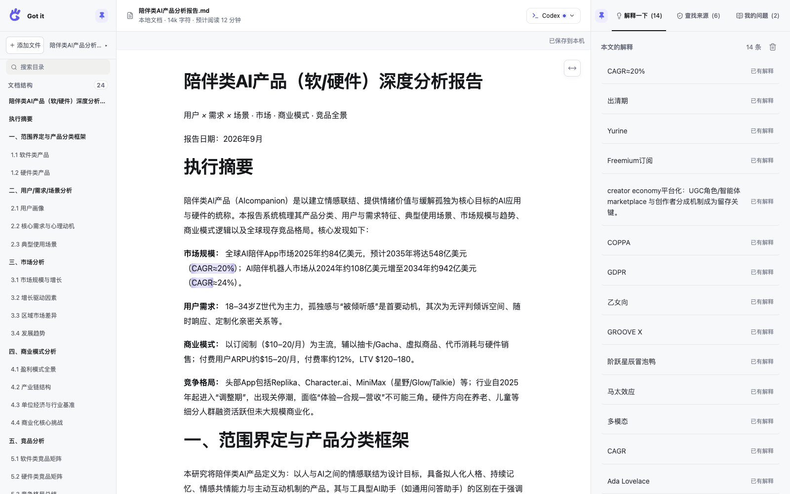
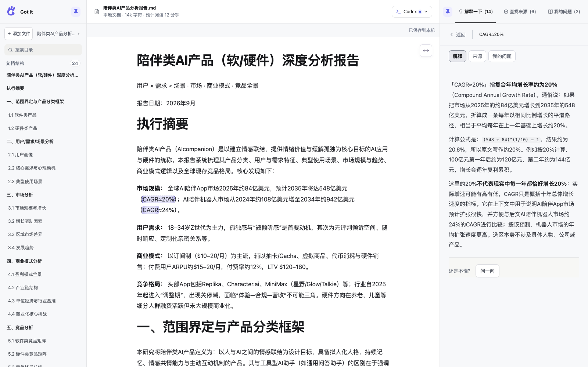
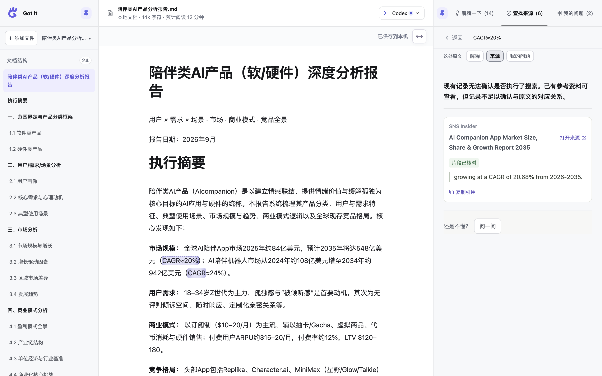
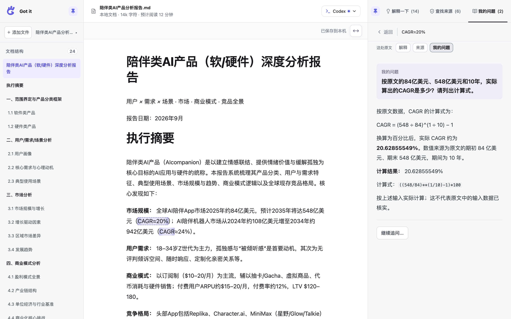
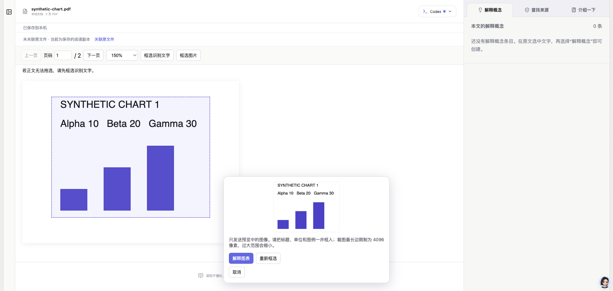

# Got it

**简体中文** · [English](README.en.md)

**读到不懂的地方，就在原文旁弄明白。**

Got it 是本地优先的 Markdown / PDF 阅读器。阅读行业报告、产品分析或技术材料时，不必反复复制段落、切到聊天窗口，再回来寻找上下文：选中文字，就能在原文旁解释概念或产品、查找来源，也可提出具体问题。阅读成果随文章保存在本机。

> **v0.1.0 · 早期试用版。** 适合已有 Codex 使用经验的读者。当前已验证 macOS；Windows/Linux 尚未实机验收。没有账号、云同步或多人协作。

## 看看它能做什么

以下截图于 **2026-10-09** 使用最新代码重新拍摄：Markdown 为《陪伴类 AI 产品分析报告》，PDF 为 WGSN《银发一代消费者洞察》。截图只展示报告片段，不分发完整材料；报告中的预测与数字不代表已经核实，AI 回答也可能出错。Markdown 回答沿用已保存的真实模型结果，本次截图未重新生成回答。

### 1. 留在文章里阅读

左侧目录定位章节，中间阅读原文，右侧回看与原文相连的知识贴。Markdown 保留标题、列表与表格；PDF 保留原始图文版面。切换材料或回看已有回答不会自动发起 AI 请求，原文件不会被改写。



### 2. 不懂术语或产品，就「解释一下」

选中 CAGR、产品名称或一段难懂的文字，点击「解释一下」，在原文旁看说明。概念、人物、公司和产品共用这一入口；缺少必要背景时按需查阅资料。仍有疑问时点击「问一问」，提交自己的问题。



### 3. 对数字有疑问，就「查找来源」

选中报告中的主张，寻找相关来源，再打开原文和核对详情。**找到相关链接不等于主张已被证实。** 搜索是否执行、网页是否可读、引用是否核对、证据是否支持主张，是不同的状态。



### 4. 带着具体问题继续读

用「问一问」提出自己的问题，例如按原文数字重新计算增长率。同一处原文的解释、来源和问题分别保留，可直接切换；点击详情顶部摘录可回到原文位置。



想问整篇材料时，在右侧「我的问题」列表下方选择「＋ 向全文提问」。短文使用完整可用文字；长文最多提供 16000 字符的结构和相关片段，并说明覆盖范围。PDF 需要足够的原生文字，不会为全文提问自动运行 OCR。

### 5. 在 PDF 原页上看图、选区、提问

下面使用 WGSN《银发一代消费者洞察》的案例页。PDF 连续滚动，左侧章节目录支持搜索和跳转；侧栏可收起，让原页获得更多空间。


有文字层时可直接选字；图片、扫描件或复杂版面可点击「框选内容」，把图片及必要说明一起框入，再选择解释、来源或具体问题。**选择功能后才进行本机识别并发起模型请求。** 这张图停留在选区菜单，尚未生成回答。



### 让阅读保持顺手

- **调节阅读空间：** 左右侧栏可独立固定或收起，右侧知识贴可拖动调宽；窄屏使用抽屉。
- **按格式调节：** Markdown 右上角调正文宽度（50%–100%，默认 80%）；PDF 右上角调页面缩放（25%–400%），也可恢复自动适合宽度。偏好保存在本机。
- **保存与恢复：** 等待工具栏显示「已保存到本机」，重开后继续阅读和回看知识贴；保存失败可重试，存在不同阅读记录时保留双方并让你选择。
- **整理知识贴：** 分类标题旁的垃圾桶开启删除模式，单条二次确认后删除，原文和同一选区的其他知识贴保留。
- **你掌握请求时机：** 打开输入框不调用模型；Enter 发送，Shift+Enter 换行。停止、超时或失败时保留已有内容并允许重试。

当前默认模型为 **GPT-6.1 SOL / medium**，可在 AI 设置中查看本机 Codex 返回的可用模型。目标型号不可用时会提示，不自动换成其他模型。预计阅读时间在本机估算，不消耗模型额度。

更多变化与验证范围见[最新更新](docs/updates/2026-10-09-reading-controls.md)。

## 运行环境

| 项目 | 首版支持基线 |
| --- | --- |
| Node.js | **24.14.1，Node 24 系列**（见 `.nvmrc`） |
| npm | **11.x**，本次实测 11.12.1 |
| 系统 | macOS Apple Silicon 已实测；Windows/Linux 实验性 |
| 浏览器 | 本次使用 Chromium 系浏览器；其他浏览器未专项验收 |
| AI | 本机可用且已登录的 Codex；模型列表由本机 Codex 返回 |
| 网络 | 安装依赖、AI 回答和来源查找需要联网；已保存文章可本地阅读 |

macOS 优先使用系统或用户 Applications 中的 Codex.app / ChatGPT.app 运行程序（兼容新版 codex-cli/bin 目录）；没有时使用 PATH 中的 `codex`。也可用 `CODEX_CLI_PATH` 显式指定。CLI 协议可能随版本变化，本次版本与范围见[验收结果](docs/release-results.md)。

## 快速开始

克隆或下载代码，进入项目目录。若使用 nvm，可先运行 `nvm install` 和 `nvm use`。

```bash
npm ci
npm run build
npm start
```

默认浏览器会打开 <http://127.0.0.1:8787/>。保持终端运行，按 Ctrl+C 停止；之后只需 `npm start`，更新代码后重新执行安装和构建。

`npm ci` 按锁文件安装，需包含开发依赖：当前启动器 `tsx` 也用于本机运行，不要使用 `--omit=dev`。

1. 打开顶部 **AI 设置**，检查 Codex 连接；未登录时可点击「登录 Codex」到官方页面完成授权，也可使用终端 `codex login`。
2. 添加 Markdown / PDF，或先用内置示例体验。
3. Markdown 在同一段落/单元格中选字；PDF 可选字或框选图片，选择一种功能。
4. 等待「已保存到本机」，下次启动可继续阅读。

本轮已完成干净 Codex 配置下的首次登录、模型加载及登录后真实回答验收，详见验收结果。Got it 不读取、复制或保存 Codex token。首次安装无需向项目作者提供 API Key 或登录凭据。登录方式见 [Codex 官方说明](https://learn.chatgpt.com/docs/auth)。

开发：

```bash
npm run dev
```

前端为 `127.0.0.1:5173`，API 为 `127.0.0.1:8787`。禁止自动开页可设置 `BROWSER=none`；PowerShell 使用 `$env:BROWSER="none"`。环境变量需由启动终端传入，`.env.example` 是配置说明，应用不会自动读取 `.env`。

## 保存与隐私

- Markdown 快照、PDF 原文件副本、识别资源、裁图、知识贴、回答和学习状态保存在本机磁盘，不改写原文件。浏览器仅保存偏好和必要的应急缓存。
- 默认数据目录：macOS `~/Library/Application Support/Got-it`；Windows `%LOCALAPPDATA%/Got-it`；Linux `$XDG_DATA_HOME/got-it` 或 `~/.local/share/got-it`。可通过 `GOT_IT_DATA_DIR` 指定；同一数据目录只运行一个服务。
- PDF 导入打开后自动生成原文章节目录：优先读取内置书签，否则在本机提取原文大标题；识别期间可继续阅读，目录显示页码、支持标题搜索及点击跳转。成功后自动保存，重开直接恢复；旧库无目录的 PDF 打开时自动补建。仅识别失败时显示“重新识别”，不提供核对、编辑或手动保存入口。读取/保存失败会明确提示并提供对应重试；保存重试复用已有识别结果。
- PDF 的文字识别在本机进行，安装时准备中文/英文模型和 worker，阅读时不从 CDN 获取。图片解释会将确认的裁图发给模型。
- 选区 AI 请求发送当前选区、有限邻近上下文、标题和当前知识贴必要历史，不默认发送全文；只有显式「向全文提问」才准备有界的文档材料。**本地保存不等于模型离线运行。**
- 来源核对只读取有限数量的公共网页，不携带用户网页登录凭据；不是所有来源都能读取或核对。
- 保存失败会保留应急内容并提供重试；冲突时保留双方再核对。不要通过清除浏览器数据解决保存问题。
- 本机保存不等于异地备份。重要成果需另外备份应用数据目录，建议停止服务后备份整个目录。

## 当前限制

- 当前仅支持 Codex，需要自己的可用账号、网络与模型额度。一次展开一份材料；不支持 Word、原文编辑、账号、云同步或多人协作。
- PDF 上限为 50 MiB、200 页，不能加密；保持固定版面，不能像 Markdown 一样重排。图片解释需要支持图片的模型。
- 本机 OCR 首轮覆盖简体中文和英文，单次识别限 60 秒。复杂排版、数字和小字可能识别错误；当前不提供识别文字编辑入口，应回到原页核对。裁图最长边 4096 像素、上限 8 MiB。
- 无书签 PDF 的目录由本机识别，复杂标题可能遗漏或有错字；当前不提供手工编辑。切换材料会中断识别，重新打开无目录材料时自动尝试；失败可重试。
- 全文提问不能保证覆盖长文每一处内容；原生文字不足的 PDF 会说明无法处理，不把 OCR 或模型回答当成事实核实。
- 当前没有备份下载按钮。PDF 需备份完整应用数据目录；旧 Focus Stickies 工作区、`.focus` 与完整 JSON 仍可通过添加文件读取。旧版程序不能读取新增的 PDF 工作区。
- Markdown 本地相对路径图片导入尚未补齐；跨段选区不支持，原文变化较大时锚点可能需要重新定位。
- 浏览器导入不会取得原文件路径，macOS 系统选择器可建立原文件关联。原文更新需确认，旧版本与知识贴保留，不自动迁移到新版。
- 搜索执行、引用核对与证据结论分别判断；「已有回答」不代表已理解或已证实。取消、断线和超时不会生成演示回答冒充成功。
- 本地 API 仅供个人使用，**不要直接暴露到公网**。GitHub Pages 不能代替本地 API。

## 开发与发布检查

```bash
npm test
npm run build
npm run test:release
npm audit --audit-level=high
```

`build` 包含 TypeScript 检查；`test:release` 使用临时数据目录，验证构建页面、资源、HTTP 边界、缺失 Codex 和服务重启，不消耗模型额度。GitHub Actions 配置 macOS/Linux/Windows 检查，配置存在不代表远程检查已经通过。

- [发布测试计划与逐项清单](docs/release-checklist.md)
- [本轮实际结果、真实模型验证与未覆盖项](docs/release-results.md)
- [安全边界与问题报告](SECURITY.md)

维护者从含内部历史材料的工作目录发布时，运行 `npm run release:prepare` 生成 `release/` 下的白名单快照。它不包含原 Git 历史、旧验收截图、完整报告、私人路径或本机数据；首次公开时以该快照建立独立仓库；后续更新同步到现有公开仓库并保留其独立历史。不要直接推送原工作仓库。快照附带文件 SHA-256 清单，文本扫描不能代替截图人工审核。

## 许可证

项目代码采用 [MIT License](LICENSE)。文档截图仅用于说明产品，所含第三方名称、标识和报告片段不表示获得其背书，也不因此取得第三方内容的再许可权。
